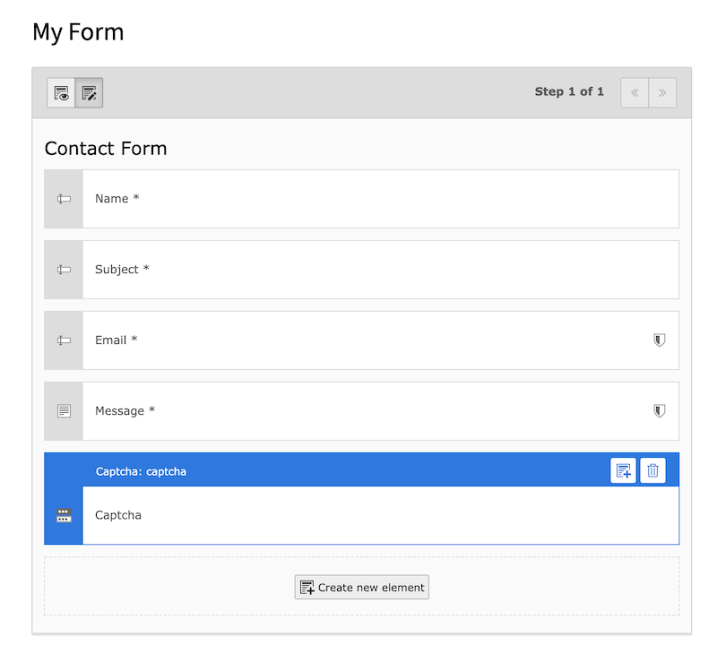

# Captcha extension for TYPO3 form

This extension adds a captcha element for the TYPO3 form component. The captcha generation uses [Gregwar/Captcha](https://github.com/Gregwar/Captcha), **no Google or 3rd party** includes.  


## Install

* ```composer require blueways/bw-captcha```
* Activate extension
* Include TypoScript template

## Configure

Add the captcha element via Form Editor to your form or directly to your yaml form. 



```yaml
renderables:
     -
        type: Captcha
        identifier: captcha
        label: Captcha
        properties:
          fluidAdditionalAttributes:
            required: required
```
