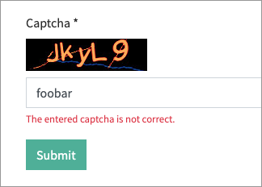

# Captcha extension for TYPO3 form

This extension adds a captcha element for the TYPO3 form component. The captcha generation uses [Gregwar/Captcha](https://github.com/Gregwar/Captcha), **no Google or 3rd party** includes.  



## Install

* ```composer require blueways/bw-captcha```
* Activate extension
* Include TypoScript template

## Usage

Add the captcha element via Form Editor to your form or directly to your yaml form. 

### Via Form Editor


### Or manual configuration

```yaml
renderables:
     -
        type: Captcha
        identifier: captcha
        label: Captcha
        properties:
          fluidAdditionalAttributes:
            required: required
```

### Configuration

To modify the captcha output, you can use the following TypoScript **constants**:

```typo3_typoscript
plugin.tx_bwcaptcha {
    settings {
        # Show reload button
        refreshButton =
        
        # The length of the captcha
        length =
        
        # The charset of the captcha
        charset =
        
        # The width of the image
        width =
        
        # The height of the image
        height =
        
        # Custom font file(s) to use (comma-separated)
        fontFiles =
        
        # Text color (e.g. 255,0,0)
        textColor =
        
        # Line color (e.g. 0,0,0)
        lineColor =
        
        # Background color (e.g. 255,255,255)
        backgroundColor =
        
        # Distortion
        distortion =
        
        # The maximum number of lines to draw in front of
        maxFrontLines =
        
        # The maximum number of lines to draw behind
        maxBehindLines =
        
        # The maximum angle of char
        maxAngle =
        
        # The maximum offset of char
        maxOffset =
        
        # Is the interpolation enabled?
        interpolation =
        
        # Ignore all effects
        ignoreAllEffects =
        
    }
}
```

## Migration to TYPO3 v12 with extension version v2.x

New controller name: If you overrode the Captcha partial and you're using the refresh button, you need to update the refresh url (`data-reload-route` attribute):

Old:

```
{f:uri.action(action:'refresh', controller: 'Captcha', ...
```

New:

```
{f:uri.action(action:'refresh', controller: element.properties.controllerName, ...
```

## Troubleshooting

### Refresh button not working

If your site is configured to use trailing slashes, the refresh url cannot be resolved. A simple fix is to add a setting for the pageType 3413, e.g.:

```
routeEnhancers:
  PageTypeSuffix:
    type: PageType
    default: /
    index: index
    map:
      /: 0
      .captcha: 3413
```
