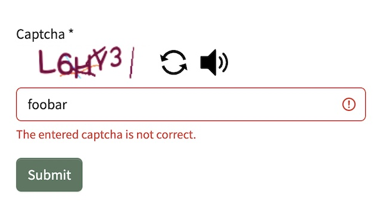
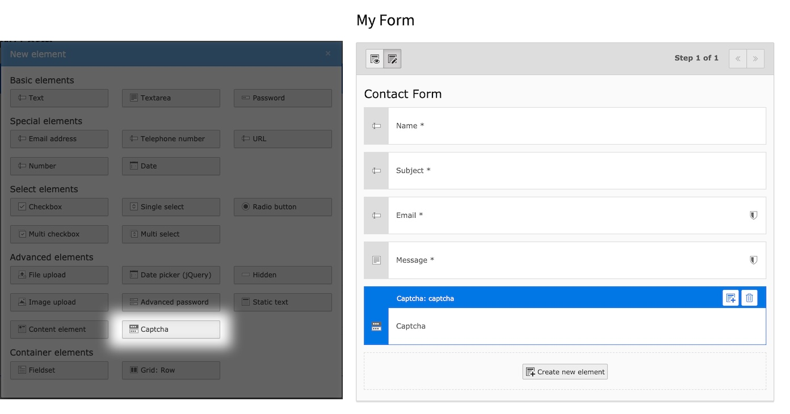

<div align="center">


# TYPO3 extension `bw_captcha`


[](https://extensions.typo3.org/extension/bw_captcha)

[](https://extensions.typo3.org/extension/bw_captcha)
[](https://packagist.org/packages/blueways/bw-captcha)

</div>

This extension adds a captcha element for the TYPO3 form component. The captcha generation
uses [Gregwar/Captcha](https://github.com/Gregwar/Captcha), **no Google or 3rd party** includes.



## Install

### Composer

```bash
composer require blueways/bw-captcha
```

### TER

[](https://extensions.typo3.org/extension/bw_captcha)

Download the zip file from
[TYPO3 extension repository (TER)](https://extensions.typo3.org/extension/bw_captcha).

## Usage

Add the captcha element via Form Editor to your form or directly to your yaml form.

### Via Form Editor



### Or manual configuration

```yaml
renderables:
  - type: Captcha
    identifier: captcha
    label: Captcha
    properties:
      fluidAdditionalAttributes:
        required: required
        autocomplete: 'off'
```

## Configuration

After installation, include the static TypoScript template or include **setup** and **constants** manually.

To modify the captcha output, you can use the following TypoScript **constants**:

```typo3_typoscript
plugin.tx_bwcaptcha {
    settings {
        # Show reload button
        refreshButton =

        # Show audio button for speech output
        audioButton =

        # The length of the captcha
        length =

        # The charset of the captcha
        charset =

        # The width of the image
        width =

        # The height of the image
        height =

        # Custom font file(s) to use (comma-separated)
        fontFiles =

        # Text color (e.g. 255,0,0)
        textColor =

        # Line color (e.g. 0,0,0)
        lineColor =

        # Background color (e.g. 255,255,255)
        backgroundColor =

        # Distortion
        distortion =

        # The maximum number of lines to draw in front of
        maxFrontLines =

        # The maximum number of lines to draw behind
        maxBehindLines =

        # The maximum angle of char
        maxAngle =

        # The maximum offset of char
        maxOffset =

        # Is the interpolation enabled?
        interpolation =

        # Ignore all effects
        ignoreAllEffects =
    }
}
```

### Overriding the captcha element

To override the captcha partial, copy it to your extension and add the partial path to
your [form setup](https://docs.typo3.org/c/typo3/cms-form/main/en-us/I/Concepts/Configuration/Index.html#yaml-registration-for-the-frontend):

```yaml
TYPO3:
  CMS:
    Form:
      prototypes:
        standard:
          formElementsDefinition:
            Form:
              renderingOptions:
                partialRootPaths:
                  1680889288: 'EXT:your_ext/Resources/Private/Frontend/Partials/'
```

## Migration from version 3.x to 4.x

This version aims to make solving the captcha more accessible. It introduces a new audio feature that reads out the
current captcha code. Missing `ARIA` properties have been added.

* Check out
  the [new captcha partial](https://github.com/maikschneider/bw_captcha/blob/master/Resources/Private/Frontend/Partials/Captcha.html)
* Audio button is enabled by default (can be disabled via `plugin.tx_bwcaptcha.settings.audioButton`)

## Migration from version 2.x to 3.x

The generation of the captcha moved to a middleware, which solves a lot of caching issues. Therefore, adjustments to the
form element partial have been made. If you've modified the partial, you need to update the image tag and refresh button
link.

**tl;dr**:

* Check out
  the [new captcha partial](https://github.com/maikschneider/bw_captcha/blob/master/Resources/Private/Frontend/Partials/Captcha.html)
* Reload button is enabled by default (can be disabled via `plugin.tx_bwcaptcha.settings.refreshButton`)
* You can re-enable the page cache, if disabled it because of this element

## Troubleshooting

### Refresh button not working

If your site is configured to use trailing slashes, the refresh url cannot be resolved. A simple fix is to add a setting
for the pageType 3413, e.g.:

```yaml
routeEnhancers:
  PageTypeSuffix:
    type: PageType
    default: /
    index: index
    map:
      /: 0
      .captcha: 3413
      .audio: 3414
```

## Contribute

This extension was made by Maik Schneider: Feel free to contribute!

* [Github-Repository](https://github.com/maikschneider/bw_captcha)

Thanks to [blueways](https://www.blueways.de/) and [XIMA](https://www.xima.de/)!
